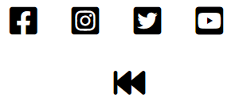
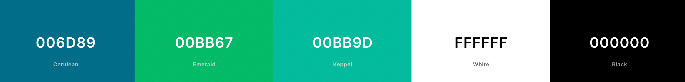
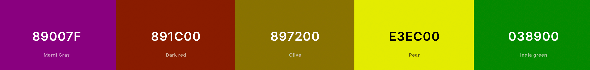
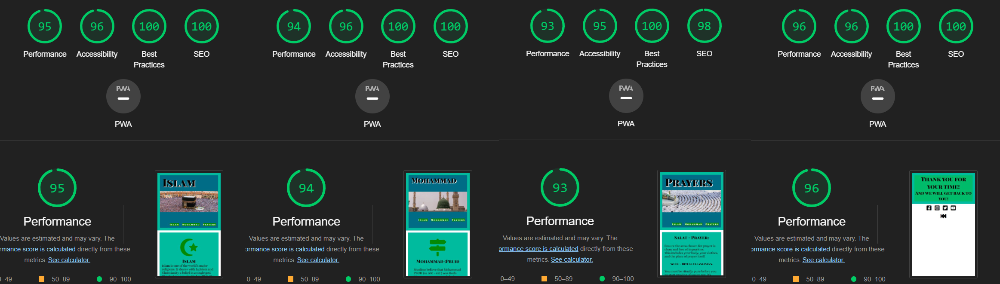

# Islam For Beginners!
[My webpage!](https://miswaq.github.io/islam-for-beginners/)

This page is directed to people who have some interest in Islam.
It can be a person who wants to know what Islam is. A person who recently have converted. Or maybe someone who has a family member or friend who converted. And wish to understand what this person is believing.
 

As the world have a lot of misconceptions about Islam I would suggest to you that best person to ask about Islam is a scholar if you cant find a scholar then try to find a practicing Muslim to ask your questions.

Here I will try to give you short and simple informative page where you can get a little basic information about Islam. And if one want to indulge in learning more about Islam.
One can find a lot of information online both from Muslim and non Muslim researchers.

 
 

##### Useful site!
* This is a good page to find information about Islam! --> [IslamOnline](https://islamonline.net/en/category/discover-islam/)
 

### But here we will focus on 3 parts of Islam.

1. Islam and the five pillars of faith.
2. Mohammed (Pbuh) life summarized.
3. The five daily Prayers
 
 

## Header!

On all 3 pages (Islam, Mohammad, Prayers) the name of the page and e unique image is placed to show the user what page there in. Mecca as a picture representing Islam. The prophets mosque in Medina to represent Mohammad. And Muslims prostrating next to the Kaaba to represent Prayers.

On all three pages the background, header and link colors are the same to make the user feel they are on the same homepage.

The black and white header colors are so that the text always is readable

 
 

## Navigation!

The navigation bar is identical on each of the three pages. So that the user easily can move around the page.

When hovering over the navlinks the color changes to indicate where the user might go if they click

 
 

## 1. Islam!

### Islam's Five Pillars:

   #### Iman - (Shahadah) Testimony of faith:
            The testimony consists of two testimonies:
            1. There is no God worthy of worship accept Allah.
            2. Mohammad is the servant and messenger of Allah.
         
   #### Salat - Five daily Prayers:
            Every Muslim must perform the five daily prayers.
            1. Fajr - morning prayer
            2. Zuhur - midday prayer
            3. Asr - afternoon prayer
            4. Magrib - sunset prayer
            5. Isha - night prayer
          
  #### Saum - Fasting during the month of Ramadan:
            Every able person has to fast during Ramadan month.
            Except for some exceptions that are excused from fasting.
            The fast is Obligatory on every Muslim.
            
  #### Zakat - Paying annually to the needy:
            Every person who has the means has to give Zakat!
            Zakat are calculated from ones savings in a year.
            2.5% of those savings has to go to the poor and needy.
            But if you don't have anything of value saved for a year you are excused.
            
  #### Hajj - Pilgrimage to Mecca:
            Everyone who has the ability and means has to perform Hajj.
            It is Obligatory for every Muslim to go for pilgrimage at least
            ones in ones life time.
 
 

Here I have chosen to indicate the title of the subject Islam with the moon and star that symbolizes Islam. And on the different pillars I put some icons that symbolices that specific pillar.

   -  Finger as Muslim raise there finger as they say the shahada that God is One
   -  The mat symbolizing the place where one prays
   -  The forbidden sign to show that you are forbidden things like food, drinks and sexual-intercourse during certain time of the day
   -  The money symbolizes that you give some of your wealth to charity
   -  The Kaaba because Mecca is the place of pilgrimage
 
 

## 2. Mohammad (PBUH)!

### The life of the Prophet:

Here is a short story of the Prophet Mohammad (PBUH). It tells about about who believes in him as a prophet. Where he was born and a little about his childhood, when he lost his parents and who raised him, when he got married, when he receaved revelation, what happend after revelation. And so on

 
 

I divided the text so it becomes easier to read. I only used one sign icon to show that the prophet is the way.

 
 

## 3. Prayers!

### The five daily Prayers:

The Prayer is one of the most important pillar of Islam.
Here I talk about importance of being ablution (Wudu - Ritual cleanliness). And then give a short explanation what the five daily prayer is.

   ### Five Prayers: ###
   
      Fajr: Morning Prayer! 
      Zuhur: Midday Prayer!
      Asr: Afternoon Prayer!
      Magrib: Sunset Prayer!
      Isha: Night Prayer!
 
 

I chose to put pictures on the left side for the user to get a feel of when the prayer is during the day

## Form result!

 
 

The result page I made simple with no pictures and just a border around the text and on the footer I put an extra icon.

 
 

## Footer!

   #### Footer features:
 

The footer I made the same on all pages except for the result page. On that page I added one more icon so that the user can go back to the start.

   #### Footer links:
 

I chose links to different convert groups for the user to get in contact with people who might understand there questions. And guide them in further research into Islam.

 
 

## Colors!

   #### Main colors I have used are:

 
 

#### Icon colors are:

 
 
 

## Lighthouse test using DevTool:

 
 

## HTML CSS validation!
- [W3 validator HTML](https://validator.w3.org/) - PASS!
- [W3C CSS validator](https://jigsaw.w3.org/css-validator/) - PASS!
 
 

## Bugfix

#### When I had problems solving an issue here is where I turned.

   - [Slack](https://slack.com/)
   - [DevMozilla](https://developer.mozilla.org/en-US/docs/Web/HTML)
   - [W3Schools](https://www.w3schools.com/)
   - [StackOverflow](https://stackoverflow.com/)
   - [LoveRunning](https://github.com/Code-Institute-Solutions/love-running-2.0-sourcecode)
 
 

## Source

   #### Content I have used and would like to give a shout out to is:
   - Facts about Islam was taken from:
            [AsianArtMuseum](https://education.asianart.org/resources/an-introduction-to-islam/)
   - Facts about the five pillars:
            [NewMuslims](https://www.newmuslims.com/)
   - Facts about Prophet Mohammad (PBUH) was taken from:
            [IslamCity](https://www.islamicity.org/17626/a-brief-biography-of-prophet-muhammad/)
   - Facts about the prayers was taken from:
            [MuslimHands](https://muslimhands.org.uk/)
            [Wikihow](https://www.wikihow.com/Pray-in-Islam/)
 
 

   #### Those who I want to thank for the images are:
   - Mecca img from:
            [PexelUser-Konevi](https://images.pexels.com/photos/4346403/pexels-photo-4346403.jpeg)
   - Medina img from:
            [PexelUser-Yasir Gürbüz](https://images.pexels.com/photos/12593614/pexels-photo-12593614.jpeg)
   - Prayer img from:
            [TheNationalNews](https://www.thenationalnews.com/gulf-news/saudi-arabia/)  
   - Suns position at the time of prayer img from:
           [LearnReligions-Huda](https://www.learnreligions.com/islamic-prayer-timings-2003811)
 
 

   #### Icons and fonts resizing imgs:
   - Icons was taken from:
            [FontAwsome](https://fontawesome.com/)
   - Icon on homepage tab from:
            [FavIconGenerator](https://www.favicon-generator.org/)
   - Fonts taken from:
            [GoogleFonts](https://fonts.google.com/)
   - Image resizing site I used:
            [TinyPNG](https://tinypng.com/)
            [ILoveImg](https://www.iloveimg.com/)
 
 

   #### Social Media Links to:
   - [Facebook](https://www.facebook.com/groups/716161341734931/)
   - [Instagram](https://www.instagram.com/muslimconvertstories/)
   - [Twitter](https://twitter.com/MusIimConverts)
   - [YouTube](https://www.youtube.com/@MuslimConvertStories) 
 
 
 

## Clone my .

   #### These are the steps to clone:
   1. Go to [Repository](https://github.com/MiswaQ/islam-for-beginners)!
   2. Click <>Code!
   3. Copy!
   4. Open Terminal!
   5. Write git clone https://github.com/MiswaQ/islam-for-beginners

   ##### Now you will download my Repository to your computer!
 
 

## Deployment:
   
   #### I deployed to GitHub pages with these steps:
   1. In the repository for islam-for-beginners I chose Settings.
   2. On the left side of the screen I chose Pages.
   3. From the branch menu I chose Main.
   4. Then root.
   5. Then I had to wait for a couple of min for the link to get online.
   
   https://miswaq.github.io/islam-for-beginners/
    
    
   
   ## Contact!
   Contact me at:
    
   **Email** ´MiswaQ@gmail.com´
    
   **Skype** [Abdulrahman Zekroum Aregai](https://join.skype.com/invite/GDTp54gY6csh)
    
    
   
   # Good Bye!
   ## And hope you have enjoyed your stay!
   ### Go in Peace!

   

